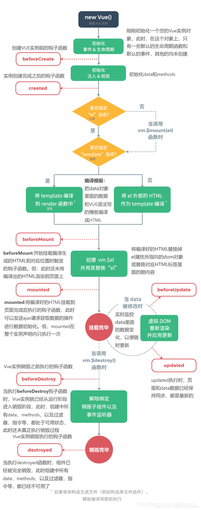

## 进阶语法

### 自定义指令

指令用于简化 DOM 操作，相当于对基础 DOM 操作的一种封装

<ul>
<li>自定义全局指令</li>
<li>自定义局部指令</li>
</ul>

#### 自定义全局指令

指的是可以被任意 Vue 实例或组件使用的指令

```js
Vue.directive("focus", {
  inserted: function (el) {
    el.focus();
  },
});
```

```html
<div id="app">
  <input type="text" v-focus />
</div>
```

#### 自定义局部指令

指的是可以在当前 Vue 实例或组件内使用的指令 [文档](https://v2.cn.vuejs.org/v2/guide/custom-directive.html)

```js
new Vue({
  // ...省略其他代码
  directives: {
    focus: {
      inserted(el) {
        el.focus();
      },
    },
  },
});
```

```html
<div id="app">
  <input type="text" v-focus />
</div>
```

#### 过滤器

过滤器用于进行文本内容格式化处理 <br/>
过滤器可以在插值表达式和 v-bind 中使用

<ul>
<li>全局过滤器</li>
<li>局部过滤器</li>
</ul>

##### 全局过滤器

可以在任意 Vue 实例中使用

```js
Vue.filter("过滤器名称", function (value) {
  // 逻辑代码
  return "处理结果";
});
```

过滤器能在插值表达式和 v-bind 中使用，通过管道符|连接数据

```html
<div id="app">
  <!-- v-bind中使用 -->
  <div v-bind:id="id|filterId"></div>
  <!--在插值表达式中-->
  <div>{{content | filterContent}}</div>
</div>
```

可以将一个数据传入到多个过滤器中进行处理

```html
<div id="app">
  <div>{{content | filterA | filterB}}</div>
</div>
```

一个过滤器可以传入多个参数

```html
<div id="app">
  <!-- filterContent实参为 content, part1, part2-->
  <div>{{content | filterContent(part1, part2)}}</div>
</div>
```

##### 局部过滤器

局部过滤器只能在当前 Vue 实例中使用

```js
new Vue({
  // ...省略其他代码
  filters: {
    ["filterName"]: function (value) {
      // 逻辑代码
      return "result";
    },
  },
});
```

局部过滤器和全局过滤器重名，局部过滤器有效

##### 计算属性

在 Vue.js 的视图中不建议书写复杂逻辑，这样不利于维护。

```html
<div id="app">
  <p>{{Math.max.apply(null, arr)}}</p>
  <p>{{Math.max.apply(null, arr)}}</p>
  <p>{{Math.max.apply(null, arr)}}</p>
</div>
```

封装函数是很好的方式，但有时重复的计算会消耗不必要的性能。

```js
const vm = new Vue({
  el: "#app",
  data: {
    arr: [1, 2, 3, 4, 5, 6],
  },
  methods: {
    getSum() {
      return this.arr.reduce((pre, cur) => pre + cur);
    },
  },
});
```

```html
<div id="app">
  <p>{{getSum()}}</p>
  <p>{{getSum()}}</p>
  <p>{{getSum()}}</p>
</div>
```

如何去提高执行效率? 使用计算属性-使用时为属性形式，访问时会自动执行对应函数

```js
const vm = new Vue({
  el: "#app",
  data: {
    arr: [1, 2, 3, 4, 5, 6],
  },
  computed: {
    result() {
      return this.arr.reduce((pre, cur) => pre + cur);
    },
  },
});
```

```html
<div id="app">
  <p>{{result}}</p>
  <p>{{result}}</p>
  <p>{{result}}</p>
</div>
```

methods 与 computed 区别

<ul>
<li>computed具有缓存性，methods没有</li>
<li>computed通过属性名访问，methods需要调用</li>
<li>computed仅适用于计算操作</li>
</ul>

###### 计算属性练习

准备一个数组，根据数组数据创建列表(当数据大于 10 时创建 li，否则不创建)

思考以下三种方式

<ul>
<li>v-if & v-for(不推荐)</li>
<li>v-for & methods(单次调用适合)</li>
<li>v-for & computed(多次调用适合)</li>
</ul>

###### 计算属性的 setter

计算属性默认只有 getter，Vue.js 也允许给计算属性设置 setter

```js
const vm = new Vue({
  computed: {
    getResult: {
      // getter
      get: function () {
        // 逻辑代码
      },
      // setter
      set: function (newValue) {
        // 逻辑代码
      },
    },
  },
});
```

##### 侦听器

侦听器用于监听数据变化并执行指定操作

```js
new Vue({
  el: "#app",
  data: {
    value: "",
  },
  watch: {
    value(newValue, oldValue) {
      // 逻辑代码
    },
  },
});
```

为了监听对象内部值的变化，需要将 watch 书写为对象，并设置选项 deep:true, 这时通过 handler 设置处理函数。

```js
new Vue({
  el: "#app",
  data: {
    obj: {
      content1: "内容1",
      content2: "内容2",
    },
  },
  watch: {
    obj: {
      deep: true,
      handler(val, oldVal) {
        console.log(val, oldVal);
      },
    },
  },
});
```

注意:

<ul>
<li>当更改(非替换)数组或对象时，回调函数中的新值与旧值相同，因为它们的引用都指向同一个数组，对象
</li>
<li>数组操作不要使用索引与length，无法触发侦听器函数</li>
</ul>

##### Vue DevTools

Vue.js devtools 是 Vue 官方提供用来调试 Vue 应用的工具
注意:

<ul>
<li>网页必须应用了Vue.js功能才能看到Vue DevTools(F12 开发者工具)</li>
<li>网页必须使用Vue.js而不是Vue.min.js</li>
<li>网页需要在http协议下打开，而不是使用file协议本地打开</li>
</ul>

##### Vue.js 生命周期

指的是 Vue 实例的生命周期<br/>
指的是实例从创建到运行，再到销毁的过程


###### Vue.js 生命周期函数

也可以叫做生命周期钩子<br/>
通过设置生命周期函数，可以在生命周期的特定阶段执行功能

<ul>
<li>创建阶段: (特点:每个实例只能执行一次)
<ul>
<li>beforeCreate: 实例初始化之前调用</li>
<li><b>created</b>: 实例创建后调用</li>
<li>beforeMount: 实例挂载之前调用</li>
<li><b>mounted</b>: 实例挂载完毕</li>
</ul></li>
<li>运行阶段: (特点:按需调用)<ul>
<li>beforeUpdate: 数据更新后，视图更新前调用</li>
<li>updated: 视图更新后调用</li>
</ul></li>
<li>销毁阶段:<ul>
<li>beforeDestory: 实例销毁之前调用</li>
<li>destroyed: 实例销毁后调用</li>
</ul></li>
</ul>

### 综合案例 TODOMVC

<ul>
<li>准备工作</li>
<li>需求分析</li>
<li>功能实现</li>
</ul>

准备工作:<br/> 1.[github](https://github.com/tastejs/todomvc-app-template)克隆 <br/> 2.进入到项目目录，安装项目依赖
cd/npm i<br/> 3.安装 vue: npm i vue@2.7.16

#### 需求分析

<ul>
<li>事项列表展示<ul><li>有事项的情况</li><li>没事项的情况</li></ul></li>
<li>状态栏展示<ul><li>个数展示</li><li>单位处理</li></ul></li>
<li>事项状态切换<ul><li>单个事项切换</li><li>多个事项切换</li></ul></li>
<li>事项新增<ul><li>内容检测</li><li>回车新增</li></ul></li>
<li>事项删除<ul><li>单个事项删除</li><li>已完成事项删除</li></ul></li>
<li>事项编辑<ul><li>触发编辑</li><li>取消编辑</li><li>保存编辑</li></ul></li>
<li>事项筛选<ul><li>点击切换显示类别</li><li>更新渲染所有事项</li></ul></li>
<li>事项数据持久化<ul><li>读取本地存储</li><li>更本地存储</li></ul></li>
</ul>

##### 事项列表展示

<ul>
<li>引入vue.js文件，创建Vue实例设置挂载元素</li>
<li>在data中设置todos存储初始数据</li>
</ul>

```js
new Vue({
  el: "#app",
  data: {
    todos: [
      { id: 1, title: "示例内容1", completed: false },
      { id: 2, title: "示例内容2", completed: true },
      { id: 3, title: "示例内容3", completed: true },
    ],
  },
});
```

<ul>
<li>设置事项视图</li>
<li>设置有无事项时的显示状态: .main .footer v-show="todos.length"</li>
</ul>

##### 状态栏信息展示

需要实现的功能为

<ul>
<li>个数展示(remaining)</li>
<li>单位处理(plurlize)</li>
</ul>

##### 事项状态切换

需要实现的功能为

<ul>
<li>单个事项切换:已经通过<code>v-model="todo.completed"</code>的设置实现了，体会双向数据绑定的好处</li>
<li>多个事项切换(toggle-all):1.单个事项操作; 2.全选框操作</li>
</ul>

设置 v-model 后，主动操作 toggle-all 相当于设置 allDone 数据，这时需要给 allDone 设置 setter 来处理

##### 事项新增

实现的功能为:

<ul>
<li>输入框内容绑定</li>
<li>回车新增事项</li>
</ul>

<ul>
<li>在data中设置newTodo用于存储数据，并绑定给新输入框</li>
<li>输入框回车时检测内容，并根据输入内容新增事项到todos</li>
</ul>
