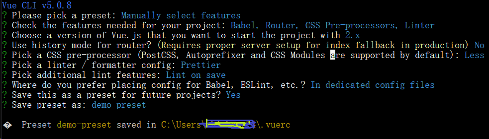

## Vue CLI(现在推荐 Vite)

[Vue CLI](https://cli.vuejs.org/zh/) 是一个基于 Vue.js 进行快速开发的完整系统，称为脚手架工具。
好处:

<ul>
<li>统一项目的架构风格</li>
<li>初始化配置项目依赖</li>
<li>提供单文件组件</li>
</ul>

操作方式: 命令行工具

<ul>
<li>安装</li>
<li>项目搭建</li>
<li>目录与文件</li>
<li>打包与部署</li>
</ul>

#### 安装

```sh
npm install -g @vue/cli
vue --version
# 升级cli版本
npm update -g @vue/cli
```

#### 项目搭建

创建项目:<br/>
`vue create project-demo`

选择 preset(预设)，选择包管理器，创建完成


```sh
### 运行
npm run serve
### http://localhost:8080/#/
```

预设保存路径:C:\Users\username\\.vuerc<br/>
不需要预设的时候可以直接删掉这个文件

#### 目录与文件

```bash
project-structure
├── public                  # 预览文件目录
│   ├── favicon.ico
│   └── index.html
├── src
│   ├── assets              # 静态资源目录
│   │   └── logo.png
│   ├── components          # 项目组件目录
│   │   └── HelloWorld.vue
│   ├── router
│   │   └── index.js
│   ├── views
│   │   ├── AboutView.vue
│   │   └── HomeView.vue
│   ├── App.vue             # 根组件
│   └── main.js             # 入口文件
├── .browserslistrc
├── .eslintrc.js
├── README.md
├── babel.config.js
├── jsconfig.json
├── package-lock.json
├── package.json
└── vue.config.js
```

单文件组件可以将组件的功能统一保存在以.vue 为拓展名的文件中。

```html
<!--.vue文件三层结构-->
<template></template>
<script></script>
<style scoped></style>
```

#### 打包与部署

打包就是将 Vue CLI 项目编译为浏览器可识别的文件。<br/>
命令:

`npm run build ### 完成后生成 dist 目录`

部署指的是将 Vue 项目 dist 目录部署到服务器上<br/>
安装静态文件服务器<br>
` npm install -g serve`<br/>
在 dist 目录下通过 `serve` 命令部署 or 项目根目录下`serve dist`

### 生成项目结构可使用

<ul>
<li><a href="https://www.npmjs.com/package/tree-node-cli">tree-node-cli</a> | tree-cli</li>
<li>自带的命令:tree</li>
<li>vscode插件<a href="https://blog.csdn.net/H_jrqn/article/details/129180523">project-tree</a></li>
</ul>

tree-node-cli in Windows10:<br/>
`treee -I "node_modules|.git|.gitignore" -a --dirs-first`
