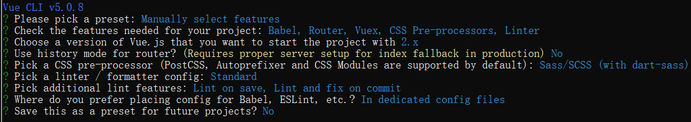

# 拉勾教育管理系统项目实战

技术栈 vue2 + vue router + vuex nodev18.12.0 npmv8.19.2 mirror:https://registry.npmmirror.com/

### 项目准备

#### 使用 Vue CLI 创建项目

```bash
npm install -g @vue/cli
vue create edu-boss-fed # Manually select features Babel+Router+Vuex+CSS Pre-processors+Linter/Formatter + v2
```



```bash
cd edu-boss-fed
npn run serve
access http://localhost:8080/#/
```

#### Git 版本管理

github 上创建 edu-boss-fed 项目(默认配置即可，无需任何勾选)，然后本地 cli 中运行

```bash
git init
git branch -M main
git remote add origin https://github.com/thinkerr24/edu-boss-fed.git
git remote -v
git push -u origin main # -u表示保存后续选项，之后push直接git push即可
```

#### 目录结构说明

```bash
edu-boss-fed
├── public
│   ├── favicon.ico
│   └── index.html
├── src
│   ├── assets
│   │   └── logo.png
│   ├── components
│   │   └── HelloWorld.vue
│   ├── router
│   │   └── index.js
│   ├── store
│   │   └── index.js
│   ├── views
│   │   ├── AboutView.vue
│   │   └── HomeView.vue
│   ├── App.vue
│   └── main.js
├── .browserslistrc
├── .editorconfig
├── .eslintrc.js
├── README.md
├── babel.config.js
├── jsconfig.json
├── lint-staged.config.js
├── package-lock.json
├── package.json
└── vue.config.js
```
