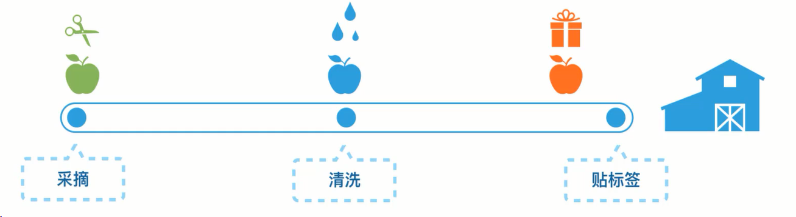
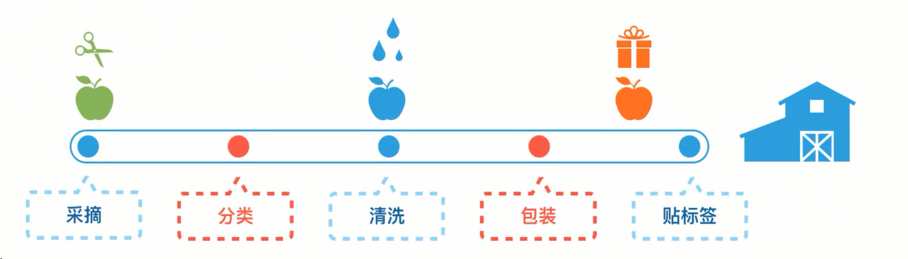
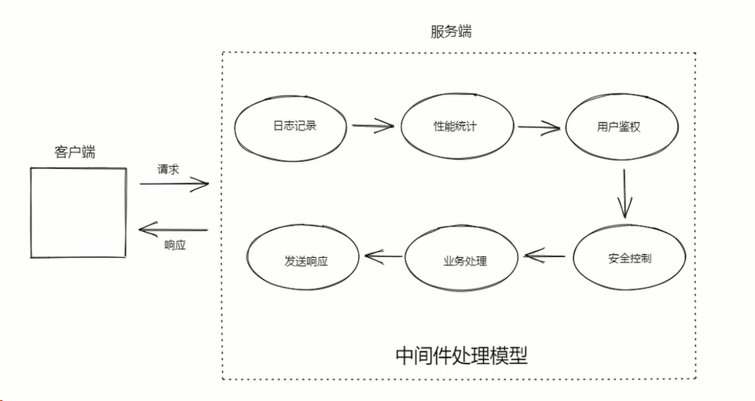
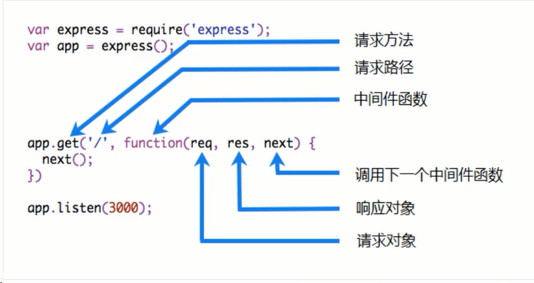
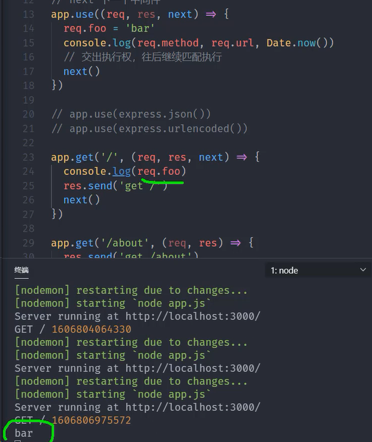

# Express

### What is Express?

Express 是一个快速，极简的 NodeJS web 应用开发框架，通过它，可以轻松地构建各种 web 应用，比如 接口服务，传统 web 网站，开发工具集成等等

Express 本身是极简的，仅仅提供了 web 开发的基础功能，但是它通过中间件的方式集成了许许多多的外部插件来处理 HTTP 请求:

1.body-parse: 解析 HTT 请求体  
2.compression: 压缩 HTTP 请求  
3.cookie-parser: 解析 cookie 数据  
4.cors: 处理跨域资源请求  
5.morgan: HTTP 请求日志记录  
...

Express 中间件的特性固然强大，但是它提供的灵活性是一把双刃剑。它让 Express 本身变得更加灵活和简单，缺点在于虽然有一些中间件包可以解决几乎所有问题或需求，但是挑选合适的包有时也会成为一个挑战

Express 不对 Node.js 已有的特性进行二次抽象，只是在它之上又拓展了 web 应用所需要的基本功能

内部使用的还是 http 模块，请求对象继承自 http.IncomingMessage，响应对象继承自 http.ServerResponse

由很多流行框架基于 Express LoopBack, Sails, NestJS:一个渐进式的 Node.js 框架，用于在 Typescript 和 Javascript(ES6, ES7, ES8)之上构建高效可扩展的企业级服务器端应用程序

### Express 特性

简单易学  
丰富的基础 API 支持，以及常用的 HTTP 辅助程序如重定向缓存等  
强大的路由功能  
灵活的中间件  
高性能  
非常稳定(源代码几乎 100%测试覆盖率)  
视图系统支持 14 个以上的主流模板引擎  

#### Express 发展历史

### Express 应用场景

1.传统 Web 网站(ghost.org)   2.接口服务   3.服务端渲染中间层   4.开发工具(JSON Server, webpack-dev-server)

## Express 基本使用

### Hello, World

mkdir myapp  
npm init -y  
npm i express  
app.js:  
`const express = require("express");
const app = express();
const port = 3001;
// for post req.body(undefined) parse
app.use(express.json());
app.get("/", (req, res) => {
res.send("<h1>Hello</h1>");
});
app.get("/hello", (req, res) => {
res.json({
msg: "hello Json",
});
});
app.listen(port, () => {
console.log("server running at port 3001");
});`

### 路由基础

路由指确定应用程序如何响应客户端对特定端点的请求，该特定端点是 URI(或路径)+特定的 HTTP 请求方法(GET, POST,PUT, DELETE 等)  
每个路由可以具有一个或多个处理程序函数，这些函数在匹配该路由时执行。路由定义采用以下结构: `app.METHOD(PATH, HANDLER)`  
app 是 Express 实例;METHOD 是小写的 HTTP 请求方法;PATH 是服务器上的路径;HANDLER 是当路由匹配时执行的功能

## 请求与响应

Express 应用使用路由回调函数的参数:request 和 response 对象来处理请求和响应的数据，对象名简写为 req 和 res
`app.get('/', function(request, response) {
    // TO DO
});
`
Express 不对 Node.js 已有的特性进行二次抽象，只是在它之上扩展了 web 应用所需的基本功能  

1.内部使用的还是 http 模块   2.请求对象继承自 http.IncomingMessage  3.响应对象继承自:http.ServerResponse  
Express 拓展了 HTTP 模块中的请求和响应对象

### 请求对象

req 对象代表 HTTP 请求，并具有请求查询字符串，参数，正文，HTTP 标头等属性  
console.log(req.url); // 地址 /  
console.log(req.method); // 方法 GET  
console.log(req.headers); // 请求头
{
'content-type': 'application/json',
'user-agent': 'PostmanRuntime/7.28.4',
accept: '_/_',
'postman-token': '6cc617b8-e833-4f52-88c0-26efaf53b24d',
host: 'localhost:3001',
'accept-encoding': 'gzip, deflate, br',
connection: 'keep-alive',
'content-length': '160'
}

### 响应对象

res 对象表示 Express 应用在收到 HTTP 请求时发送的 HTTP 响应
`//res.statusCode = 201; // 设置响应码
  // res.write("a");
  // res.write("b");
  // res.write("c");
  // res.end(); // print 'abc' on page
  // res.end("Abc"); // print 'Abc'
  // res.send("<h2>123</h2>");
  // res.cookie("foo", "bar");
  //res.status(201).send({ msg:"I'm OK"});
 `

## 案例

通过创建一个简单的 CRUD 接口服务来掌握 Express 的基本用法  
GET /todos  
GET /todos/:id //动态路径, ":id""表示一个任意的数据, 比如 1 2 ...100 通过"req.params.id" 获取 
POST /todos  
PATCH /todos/:id  
DELETE /todos/:id  

## Express 中间件

基本用法  
案例: 给每个请求方法加上日志功能(req.method+req.url+Date.now())  
这种通用型功能可以使用中间件，避免代码污染业务代码  
中间件的顺序很重要，因为请求来了(代码)都是从上往下执行，使用 app.use 中间件要写在所有请求方法前  
`const app = express();
const myLogger = (req) => console.log(req.method, req.url, Date.now());

// req 请求对象
// res 响应对象
// next 下一个中间件
app.use((req, res, next) => {
myLogger(req);
next(); // 这一行要加，不然不会走到匹配的那个路径方法中
});
app.get('/', (req, res) => res.send('get /'));
app.get('/about', (req, res) => res.send('get /about'));
`

### 中间件基本概念

Express 的最大特色，也是最主要的一个设计就是中间件。一个 Express 应用就是由许许多多的中间件来完成的。 
通过现实中的自来水厂的净水流程来理解: 
  
中间每一个环节就是一个中间件，这样既提高了生产效率也提高了保证了可维护性

Express 中间件和 AOP<b> 面向切面编程</b>几乎是一个意思，就是都要结果的步骤，<b>不去修改自己的代码，以此来拓展或者处理一些功能<b/>
例子:农场的水果包装流水线一开始只有下面三个步骤:

为了提高销量，再加两道新工序且不干扰已有的流程，同时如果没有增加收益可以随时撤销新工序:

### AOP(Aspect Oriented Programming)面向切面编程

1.将日志记录，性能统计，安全控制，事务处理，异常处理等代码从业务逻辑代码中划分出来，通过对这些行为的分离，我们希望可以<b>将它们独立到非指导业务的方法中，进而改变这些行为的时候不影响业务逻辑的代码。<b/>  

2.利用 AOP 可以对业务逻辑的各个部分进行隔离，从而使得<b>业务逻辑各部分之间的耦合度降低, 提高程序的可重用性，同时提高了开发的效率和可维护性。<b/>

总结:就是在现有代码程序中，在程序生命周期或者横向流程中加上/减去一个或多个功能，不影响原有功能。

### 中间件函数

在 Express 中，中间件就是一个可访问请求对象、响应对象和调用 next 方法的函数。 

 
在中间件函数中可以执行以下任务: 

<ul>
<li>执行任何代码</li>
<li>修改request或response对象
</li>
<li>结束请求响应周期</li>
<li>调用下一个中间件</li>
</ul>
 

  
注意:如果当前的中间件功能没有结束请求-响应周期，则必须调用 next()将控制权传递给下一个中间件功能。否则，该请求将被挂起(pending)。

## Express 中间件分类

<ul>
<li>应用程序级别中间件</li>
<li>路由级别中间件</li>
<li>错误中间件</li>
<li>内置中间件</li>
<li>第三方中间件</li>
</ul>

### 应用程序级别中间件

不关心请求路径(匹配 any 路径)  
`app.use((req, res, next) => {
  console.log('Logger time:', Date.now())
  next();
});`

限定请求路径(匹配/user/xxx)  
`app.use('/user/:id', (req, res, next) => {
  console.log('request method:', req.method);
  next();
})`

限定请求方法+请求路径(匹配 GET 方法 + path 为/user/xxx)  
`app.get('/user/:id', (req, res, next) => {
  res.send('USER');
})`

多个处理函数
`app.use('/user/:id', (req, res, next) => {
console.log('Request URL:', req.originalUrl);
next(); // 跑到当前中间件紧接着的下一个回调函数
},  (req, res, next) => {
  console.log('Request Type:', req.method);
  next(); // 脱离当前中间件，寻找下一个
})`

为同一个路径定义多个处理中间件
`app.get('/user/:id', (req, res, next) => {
console.log('ID:', req.params.id);
next(); 
},  (req, res, next) => {
  res.send('User Info'); // execute
});
app.get('/user/:id', (req, res, next) => {
  res.end(req.params.id); // won't execute
});
`

跳过中间件剩下功能，使用 next('route')
`app.use('/user/:id', (req, res, next) => {
  if (req.params.id === 0) {
    next('route');
  } else {
    next();
  }
},  (req, res, next) => {
  res.send('use xxx'); // will not execute when req.params.id === 0
});
app.get('/user/:id', (req, res, next) => {
  res.send('get xxx'); // // will  execute when req.params.id === 0
});
`

中间件可以在数组中声明为可重用——子堆栈数组
`function logOriginalUrl(req, res, next) {
  console.log(req.originalUrl);
  next();
}
function logMethod(req, res, next) {
  console.log(req.method);
  next();
}
const logStuff = [logOriginalUrl, logMethod];
app.get('/user/:id', logStuff, (req, res, next) => {
  res.send('User Info');
});
`

### 路由级别中间件

路由器级别的中间件与应用程序级中间件的工作方式相同，只不过它绑定到的实例  
`const router = express.router();`  
使用 router.use()和 router.METHOD()函数加载路由器级中间件

### 错误处理中间件

与其他中间件函数定义方式相同，区别在于使用四个参数(始终) 
(err, req, res, next)  
`app.use(function(err, req, res, next) {
console.error(err.stack);
res.status(500).send('Somthing broke!');
});`

#### 中间件处理 404

`app.use((req, res, next) => {
  res.status(404).sned('404 NOT FOUND!');
})`

#### 内置中间件

Express 本身提供的中间件函数
`express.json() 解析Content-Type为application/json格式的请求体
express.urlencoded 解析Content-Type为application/x-www.form-urlencoded格式的请求体
 express.raw() 解析Content-Type为application/octet-stream格式的请求体
express.text() 解析Content-Type为text/plain格式的请求体
 express.static() 托管静态资源文件`

#### 第三方中间件

在 4.x 版本后剔除，需要的自己加
https://expressjs.com/en/resources/middleware.html
https://github.com/orgs/expressjs/repositories

## Express 路由 summary

特俗的路由方法 app.all 用于为所有 HTTP 请求方法的路径记载中间件功能
例如无论 GET/POST/PUT/DELETE 还是 http 模块支持的其他方法，都会对路由/secret
的请求执行以下处理程序
`app.all('/secret', (req, res, next) => {
  console.log('Accessing the secret section......');
  next(); // pass control to the next handler
 })`  

### 路由路径

路由路径与请求方法结合，定义了可以进行请求的端点。路由路径可以是<b>字符串，字符串模式或正则表达式</b>。
字符?,+,\*和()是他们的正则表达式的对应的子集。连字符(-)和点(.)由基于字符串的路径按字面意义进行解释。如果需要$在路径字符串中使用美元字符(), 要将其转义([并在括号中])。例如，"/data/$book"处用于
请求的路径字符串将为"/data/([\$])book"。
Express 使用[path-to-regexp](https://www.npmjs.com/package/path-to-regexp)，查询字符串不是路由路径的一部分。

"/" match root path  
"/random.txt" match "/random.txt"  
"/ab?cd" match /acd or /abcd  
"/ab+cd" match /abcd, /abbcd, /abbbcd ...  
"/ab\*cd" match /abxcd, /abAnycd, /ab123cd ...  
"/ab(cd)?e" match /abe, /abcde  
/a/ match contain <b>any</b> 'a' route:app.get(/a/, (req, res) => {})  
/.*fly$/ match ending with fly paths:app.get(/.*fly$/, (req, res) => {})  

### 路径参数

ref:[express guide routing](https://expressjs.com/en/guide/routing.html)  
:xxx req.params.xxx

Route path: /users/:userId/book/:bookId  
Request URL: http://localhost:3000/users/34/books/8989  
req.params: {"userId": "34", "bookId": "8989"}  

Route path: /flights/:from-:to  
Request URL: http://localhost:3000/flights/LAX-SFO  
req.params: {"from": "LAX", "to": "SFO"}  

增加变量类型限定，使用括号()加正则的方式  
Route path: /user/:userId(\\d+)  
Request URL: http://localhost:3000/user/432 
req.params: {"userId": "432"}  

### 路由处理程序

app.route() 链式路由  
`app.route('/book').get((req, res) => {
}).post((req, res) => {
}).put((req, res) => {
});`
