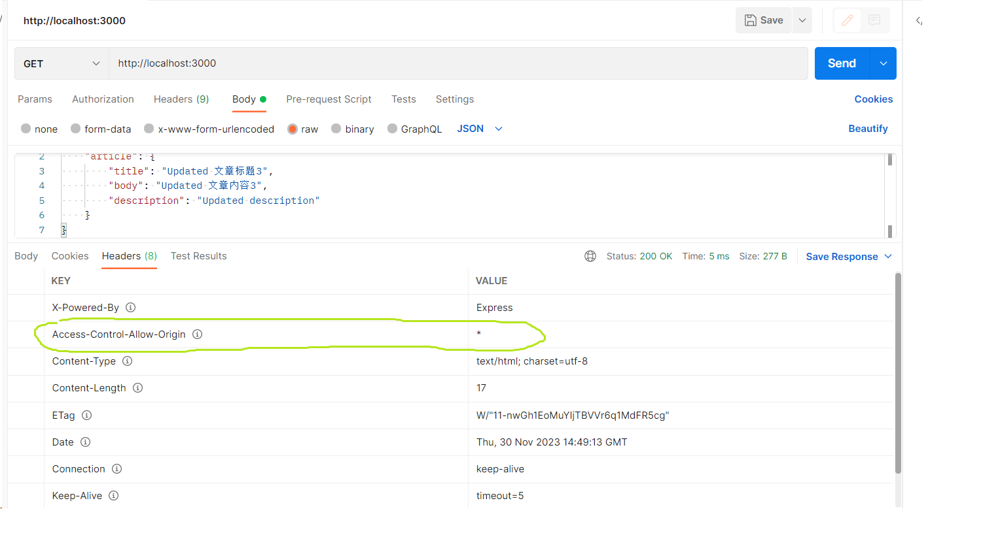

# Express 接口案例

使用 Express 开发接口服务 <br/>

1.[Github](https://github.com/gothinkster/realworld) <br/> 2.[Demo](https://demo.realworld.io/) <br/> 3.[API Doc](https://github.com/gothinkster/realworld/tree/main/api) <br/>

## RESTful 借口设计规范

### 协议

API 与用户的通信协议:尽量使用 https 协议

### 域名

应该尽量将 API 部署在专有域名之下
`https://api.example.com` <br/>
如果确定 API 很简单，不会有进一步扩展，可以考虑放在主域名下: <br/>
`https://example.org/api/`

### 版本

应该将 API 的版本号放入 URL 中:<br/>
`https://api.example.com/v1/` <br/>
另外一种做法是，将版本号放在 HTTP 头信息中(如 Github)，但不如放在 URL 方便只管

### 路径

路径又称 "终点"(endpoint), 表示 API 的具体网址。<br/>

在 RESTful 架构中，每个网址代表一种资源(resource), 所以网址中不能有动词，只能有名词，而且所用的名词往往与数据库的表格名对应。一般来说，数据库中的表都是同种记录的 "集合"(collection), 所以 API 中的名词也应该使用复数。

举例来说，有一个 API 提供动物园(zoo)的信息，还包括各种动物和雇员的信息，则路径设计如下:<br/>

<ul>
<li>https://api.example.com/v1/zoos</li>
<li>https://api.example.com/v1/animals</li>
<li>https://api.example.com/v1/employees</li>
</ul>

### HTTP 动词

对于资源具体操作类型，由 HTTP 动词表示，常见的有五个(括号里是对应的 SQL 命令):<br/>

<ul>
<li>GET(读取)：从服务器取出资源(one or many item)</li>
<li>POST(创建): 在服务器新建一个资源</li>
<li>PUT(完整更新): 在服务器更新资源(客户端提供改变后的完整资源)</li>
<li>PATCH(部分更新): 在服务器更新资源(客户端提供改变的属性)</li>
<li>DELETE(删除): 从服务器删除资源</li>
</ul>

另外还有两个不常用的 HTTP 动词:

<ul>
<li>HEAD: 获取资源的元数据</li>
<li>OPTIONS: 获取信息，关于资源的哪些属性是客户端可以改变的</li>
</ul>

Examples:<br/>

<ul>
<li>GET /zoos: 列出所有动物园</li>
<li>POST /zoos: 新建一个动物园</li>
<li>POST /zoos/ID: 根据ID获取某个指定动物园信息</li>
<li>PUT /zoos/ID: 更新某个指定动物园信息(提供该动物园的全部信息)</li>
<li>PATCH /zoos/ID: 更新某个指定动物园信息(提供该动物园的部分信息)</li>
<li>DELETE /zoos/ID: 删除某个动物园</li>
<li>GET /zoos/ID/animals: 列出某个指定动物园的所有动物</li>
<li>>DELETE /zoos/ID/animals/ID: 删除某个指定动物园的指定动物</li>
</ul>

### 过滤信息

如果记录的数量很多，服务器不可能将它们都返回给用户。API 应该提供参数，过滤返回结果，下面是一些常见的参数:

<ul>
<li>?limit=10: 指定返回记录的数量</li>
<li>?offset=10: 指定返回记录的开始位置</li>
<li>?page=2&per_page=10: 指定第二页，每页10条数据</li>
<li>?sortby=name&order=asc: 指定返回结果按照哪个属性排序，以及排序顺序</li>
<li>?animal_type_id=1: 指定筛选条件</li>
</ul>

参数的设计允许存在冗余，即允许 API 路径和 URL 参数偶尔有重复。比如 GET /zoo/ID/animals 与 GET /animals?zoo_id=ID 的含义是相同的

### 状态码

客户端的每一次请求，服务器都必须给出回应。回应包括 HTTP 状态码和数据两部分。

HTTP 状态码是一个三位数，分成五个类别([100 多种](https://developer.mozilla.org/zh-CN/docs/Web/HTTP/Status)):

<ul>
<li>1xx: 相关信息</li>
<li>2xx: 操作成功</li>
<li>3xx: 重定向</li>
<li>4xx: 客户端错误</li>
<li>5xx: 服务端错误</li>
</ul>

服务器应该尽可能返回精确的状态码<br/>
常见的有(括号中是该状态码对应的 HTTP 动词):

<ul>
<li>200 OK-[*]: 服务器成功返回用户请求的数据，该操作是幂等的(Idempotent)</li>
<li>201 CREATED-[POST]: 用户新建或修改数据成功</li>
<li>202 Accepted-[*]: 表示一个请求已经进入后台排队(异步任务) </li>
<li>204 NO CONTENT-[DELETE]: 用户删除数据成功</li>
<li>400 Bad Request-[POST/PUT/PATCH]: 由于被认为是客户端错误（例如，错误的请求语法、无效的请求消息帧或欺骗性的请求路由），服务器无法或不会处理请求，该操作是幂等的</li>
<li>401 Unauthorized -[*]: 表示用户没有权限(令牌、用户名、密码错误)</li>
<li>403 Forbidden -[*]:客户端没有访问内容的权限；也就是说，它是未经授权的，因此服务器拒绝提供请求的资源 (与 401 Unauthorized 不同，服务器知道客户端的身份)</li>
<li>404 NOT FOUND -[*]: 用户发出的请求针对的是不存在的记录，服务器没有进行操作，该操作是幂等的</li>
<li>406 Not Acceptable -[GET]: 用户请求的格式不可得(比如用户请求的JSON格式，但是只有XML格式)</li>
<li>410 Gone -[GET]: 用户请求的资源被永远删除，且不会再得到</li>
<li>422 Unprocesable entity - [POST/PUT/PATCH]: 请求格式正确，但由于语义错误而无法遵循</li>
<li>429 Too Many Requests: 用户在给定的时间内发送了太多请求（"限制请求速率"）</li>
<li>500 Internal Server Error -[*]: 服务器遇到了不知道如何处理的情况</li>
</ul>

### 返回接口

API 返回的数据格式，不应该是纯文本，而应该是应该 JSON 对象，因为这样才能返回标准的结构化数据。所以，服务器回应的 HTTP 头的 Content-Type 属性要设为 application/json。

针对不同操作，服务器向用户返回的结果应该符合以下规范:

<ul>
<li>GET /collection: 返回资源对象的列表(数组)</li>
<li>GET /collection/resource: 返回单个资源对象</li>
<li>POST /collection: 返回新生成的资源对象</li>
<li>PUT /collection/resource: 返回完整的资源对象</li>
<li>PATCH /collection/resource: 返回完整的资源对象</li>
<li>DELETE /collection/resource: 返回一个空文档</li>
</ul>

### 错误处理

一种不恰当的做法:发生错误还返回 200 状态码，把错误信息放在数据体里

```
HTTP/1.1 200 OK
Content-Type: applcation/json

{
    "status": "failure",
    "data": {
        "error": "xxxx"
    }
}
```

上面代码中，解析数据体之后才能得知操作失败 <br/>
正确的做法是，状态码反映发生的错误，具体错误信息放在数据体里返回。例子:

```
HTTP/1.1 400 Bad Request
Content-Type: applcation/json

{
    "status": "Invalid payload",
    "data": {
        "error": "This field is required."
    }
}
```

### 身份认证

基于[JWT](https://jwt.io/)的接口权限认证

<ul>
<li>字段名: Authorization</li>
<li>字段值: Bearer token数据</li>
</ul>

### 跨域处理

可以在服务端设置[CORS](https://developer.mozilla.org/zh-CN/docs/Web/HTTP/CORS)允许客户端跨域资源请求

## 创建项目

```bash
mkdir realworld-api-express
cd realworld-api-express
npm init -y
npm i express
code .
```

新建 app.js

```js
const express = require("express");

const app = express();
const PORT = process.env.PORT || 3000;

app.get("/", (req, res) => {
  res.send("<h2>Hello, World!");
});

app.listen(PORT, () => {
  console.log(`Server is running at http://localhost:${PORT}`);
});
```

```bash
nodemon app.js
```


指定 process.env.PORT:<br/>
对于类 UNIX 系统(Apple or Linux)

```bash
# once
PORT=3001 nodemon app.js
# forever
export PORT=1234
nodemon app.js
 app.js
```

对于 Windows，可以

```bash
set PORT=1234
nodemon app.js
```

也可以修改 package.json 中的 scripts:
(如果用 [express-generator](https://www.npmjs.com/package/express-generator)生产的项目，那就将<b>app.js</b> 替换成<b>./bin/www</b>)

```JSON
  "scripts": {
    "start": "set PORT=3001 && nodemon app.js"
  },
```

也可以考虑使用[dot-env](https://www.npmjs.com/package/dot-env)

### 目录结构

```bash
   config #配置文件目录
        config.default.js
   controller #用于解析用户的输入，处理后返回相应的结果
   model #数据持久层
   middleware #用于编写中间件
   router #用于配置URL路由规则
   util #工具模块
   app.js #用于自定义启动时的初始化工作
```

### 配置常见中间件

##### 解析请求体

<ul>
<li>express.json()</li>
<li>express.urlencoded()</li>
</ul>

##### 日志输出

[morgan()](https://www.npmjs.com/package/morgan)

##### 为客户端提供跨域资源请求

[cors()](https://www.npmjs.com/package/cors)

如何知道 cors 配置成功，在 response headers 里有这样一项:
Access-Control-Allow-Origin: \*


### 路由设计

[参照 openapi.yml](https://github.com/gothinkster/realworld/tree/main/api)

#### 数据验证

[express-validator](https://www.npmjs.com/package/express-validator)

#### 密码加密

hash 算法, MD5 举例

```js
const crypto = require("crypto");
const secret = "rr2023";

// 获取crypto支持的散列算法
// console.log(crypto.getHashes()); // string array, 'RSA-SHA224', 'md5', 'sha3-224' .etc
// console.log(crypto.createHash("md5").update("hello").digest("hex"));

module.exports = (str) =>
  crypto
    .createHash("md5")
    .update(secret + str)
    .digest("hex");
```

## 基于 JWT 的身份验证

[JSON Web Tokens(JWT)](https://jwt.io/)是目前最流行的跨域认证解决方案

#### 跨域认证的问题

互联网服务离不开用户认证，一般流程如下: <br/> 1.用户向服务器发送用户名和密码<br/> 2.服务器验证通过后，在当前对话(session)里面保存相关数据，比如用户角色、登录时间等<br/> 3.服务器向用户返回一个 session_id，写入用户的 Cookie<br/> 4.用户随后的每一次请求，都会通过 Cookie，将 session_id 传回服务器<br/> 5.服务器收到 session_id, 找到前期保存的数据，由此得知用户身份 <br/>

这种模式的问题是可扩展性(scaling)不好。 单机当然没问题，如果是服务器集群，或者是跨域的服务导向架构，就要求 session 数据共享，每台服务器都能读取 session。

举例来说，AB 两网站是同一家公司的关联服务，现在要求用户登录其中一个网站，再访问另一个网站就会自动登录，如何实现?

一种解决方案是 session 数据持久化，写入数据库或别的持久层。各种服务收到请求后，都向持久层请求数据。这种方案的优点是架构清晰，缺点是工程量比较大。另外，持久层挂了就会单点失败。

另一种方案是服务器索性不保存 session 数据了，所有数据都保存在客户端，每次请求都发回服务器。JWT 就是这种方案的一个代表。

### JWT 原理

[规范](https://datatracker.ietf.org/doc/html/rfc7519)

JWT 的原理是服务器认证后，生成一个 JSON 对象，发回给用户，像下面重要:<br/>

```json
{
  "姓名": "张三",
  "角色": "管理员",
  "到期时间": "2018年7月1日0点0分"
}
```

以后，用户与服务端通信的时候，都要发回这个 JSON 对象。服务端完全只靠这个对象认定用户身份。为了防止用户篡改数据，服务器在生成这个对象的时候，都会加上签名(详见后文)。

服务器就不保存如何 session 数据了，也就是说，服务器变成无状态了，从而比较容易实现拓展。

#### JWT 数据结构

实际的 JWT 大概就像如下这样:<br/>


它是一个很长的字符串，中间用(<code>.</code>)分隔成三个部分。注意，JWT 内部是没有换行的，图中只是为了便于展示才写成几行。

JWT 的三个部分依次如下:<br/>

<ul>
<li>Header(头部)</li>
<li>Payload(负载)</li>
<li>Signature(签名)</li>
</ul>

写成一行，就是下面的样子:<br/>
<code>Header.Payload.Signature</code>


#### Header

Header 部分是一个 JSON 对象，描述 JWT 的元数据，通常是下面的样子:<br/>

```json
{
  "alg": "HS256",
  "typ": "JWT"
}
```

<code>alg</code>属性表示签名的算法(algorithm)，默认 HMAC SHA256(写成 HS256); <code>typ</code>属性表示这个令牌(token)的类型，JWT 令牌统一写成<code>JWT</code>.

最后，将上面的 JSON 对象使用 Base64URL 算法(见后文)转成字符串。

#### Payload

Payload 部分也是一个 JSON 对象，用来存放实际需要传递的数据。JWT 规定了 7 个官方字段供选用:<br/>

<ul>
<li>iss(issuer): 签发人</li>
<li>exp(expiration time): 过期时间</li>
<li>sub(subject): 主题</li>
<li>aud(audience): 受众</li>
<li>nbf(Not Before): 生效时间</li>
<li>iat(Issued At): 签发时间</li>
<li>jti(JWT ID): 编号</li>
</ul>
除了官方字段，还可以在这个部分定义私有字段:<br/>

```json
{
  "sub": "123324",
  "name": "John Doe",
  "admin": true
}
```

注意, JWT 默认是不加密的，任何人都可以读到，所以不要把秘密信息放在这个部分。

这个 JSON 对象也要用 Base64URL 算法转成字符串。

#### Signature

Signature 部分是对前两部分的签名，防止数据被篡改。

首先，需要指定一个密钥(secret)。这个密钥只有服务器才知道，不能泄露。然后，使用 Header 里指定的签名算法(默认 HMAC SHA256)，按照下面的公式产生签名:

```
HMACSHA256(
  Base64UrlEncode(header) + '.' + Base64UrlEncode(payload),
  secret
)
```

算出签名以后，把 Header、Payload、Signature 三个部分拼成一个字符串，每个部分之间用"点"(<code>.</code>)分隔，就可以返回给用户。

<b>在 JWT 中，消息体是透明的，使用签名可以保证消息不被篡改。但不能实现数据加密功能。</b>

#### Base64URL

Header 和 Payload 串型化的算法是 Base64URL，这个算法和 Base64 基本类似，但有一些小的不同。

JWT 作为一个令牌(token), 有些场合可能会放到 URL 中(https://api.example.com/?token=xxx)。Base64有三个字符<code>+</code>、<code>/</code>和<code>=</code>, 在 URL 里有特殊含义，所以要被替换掉: =被省略、+替换成-，/替换成\_。这就是 Base64URL 算法。

#### JWT 的使用方式

客户端收到服务器返回的 JWT，可以存储在 Cookie 里面，也可以存储在 localStorage。

此后，客户端每次与服务器通信，都要带上这个 JWT。可以把它放在 Cookie 里自动发送，但是这样不能跨域，所以更好的做法是放在 HTTP 请求头信息<code>Authorization</code>字段里面。

```
Authorization: Bearer <token>
```

另一种做法是，跨域的时候，JWT 就放在 POST 请求的数据体里面。

### JWT 的几个特点

<ol>
<li>JWT默认是不加密，但也是可以加密的。生成原始Token以后，可以用密钥再加密一次</li>
<li>JWT不加密的情况下，不能将秘密数据写入JWT</li>
<li>JWT不仅可以用于认证，也可以用于交换信息；有效使用JWT，可以降低服务器查询数据库次数</li>
<li>JWT最大的缺点是，服务器不保存session状态，因此无法在使用过程中废止某个token，或者更改token权限。也就是说，一旦JWT签发了，在到期之前就会始终有效，除非服务器部署额外的逻辑</li>
<li>JWT本身包含了认证信息，一旦泄露，任何人都可以获得该令牌的所有权限。为减少盗用，JWT的有效期应该设置得比较短，对于一些比较重要的权限，使用时应该再次对用户进行认证</li>
<li>为了减少盗用，JWT不应该使用HTTP协议明码传输，要使用HTTPS协议传输</li>
</ol>

#### 在 Node.js 中使用 JWT

[网站上可选列表](https://jwt.io/libraries), NodeJS 环境下[推荐](https://github.com/auth0/node-jsonwebtoken):

```bash
npm install jsonwebtoken
```
