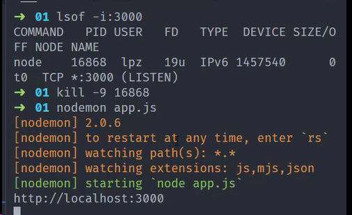
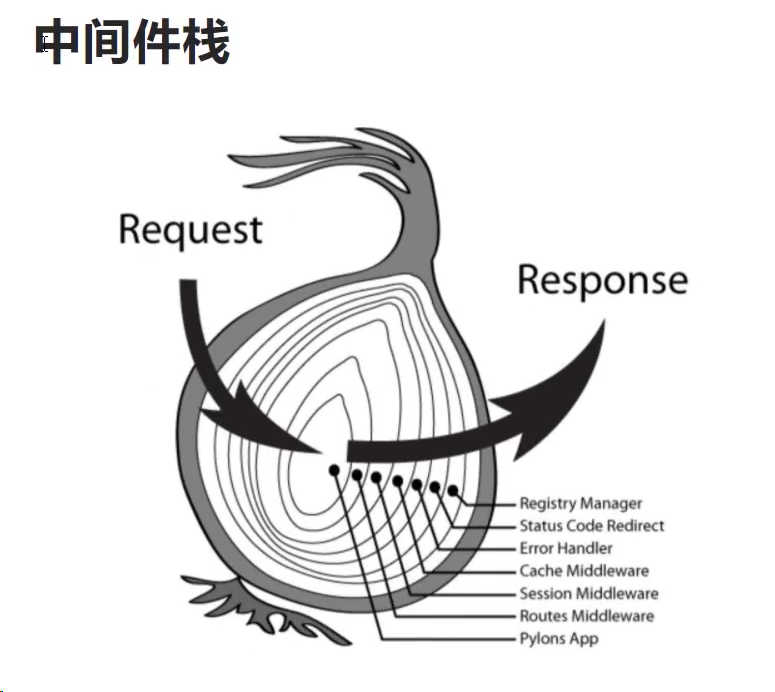
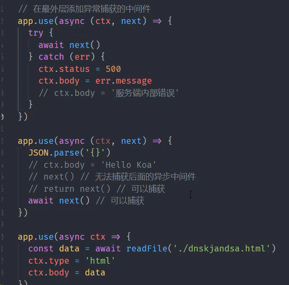

# Koa

[官网](https://koajs.com/)  
[与 express 对比](https://github.com/koajs/koa/blob/master/docs/koa-vs-express.md)
[yuque tutorial](https://www.yuque.com/lipengzhou/koa/rzwgfk)
基于 Koa 的工具/框架:[egg](https://github.com/eggjs/egg)

Koa1 基于 ES2015 中的 Generator 生成器函数结合 CO 模块 
Koa2 完全抛弃了 Generator 和 CO，升级为 ES2017 中的 async/await 函数  

Koa 中提供了 CTX 上下文对象, 没有捆绑任何中间件; Express 是拓展了 req 和 res

### Hello, Koa

`//使用Koa启动一个Http服务 npm i koa
const Koa = require("koa");
const app = new Koa();
// Koa没有路由系统，只有中间件功能
// ctx: context 上下文对象
// 请求&响应
app.use((ctx) => {
  // 匹配任意路由
  ctx.body = "<h1>Hello, Koa</h1>";
});
app.listen(3000, () => console.log("app is running at port 3000"));
`

## 上下文(Context)

Koa Context 将 node 的 request 和 response 对象封装到单个对象中，为编写 Web 应用程序和 API 提供了很多有用的方法。

每个请将创建一个 Context，并在中间件中作为接收器引用，或者 ctx 标识符，如下 code:

`app.use(async ctx => {
    ctx: // 这是Context
    ctx.request & ctx.response: // 这是 koa Request&Response
    ctx.req & ctx.res // 这是node原生request&reponse
})`

绕过 Koa 的 response 处理是不被支持的，应该避免使用以下 node 属性:  
res.statusCode res.WriteHead() res.write res.end

## 路由

`const path = ctx.path;
if (path === '/') {
    ctx.body = '/home page';
} else if(path === '/foo') {
    ctx.body = 'foo page';
} else {
     ctx.body = '404 Not Found';
}
`
更好的方法:使用官方提供的中间件[router](https://github.com/koajs/router)

#### 静态资源托管

使用 [koa-static](https://github.com/koajs/static)

`const static = require('koa-static');
const app = new Koa();
const path = require('path';)
app.use(static(path.join(__dirname, './public'))
`
如果要加虚拟路径，使用[mount](https://github.com/koajs/mount)

`const mount = require('koa-mount');
app.use(mount('/public',static(path.join(__dirname, './public')))
`

#### 路由重定向

// 重定向针对同步请求，异步请求无效
`ctx.redirect('/foo')`
// 302 Found Location: /foo

#### 中间件执行栈结构

Koa 最大特色也是最大的一个设计就是中间件(middleware)。
中间件栈，洋葱模型:

`const Koa = require("koa"); const app = new Koa();
const one = (ctx, next) => {
  console.log(">> one");
  next();
  console.log("<< one");
};
const two = (ctx, next) => {
  console.log(">> two");
  next();
  console.log("<< two");
};
const three = (ctx, next) => {
  console.log(">> three");
  next();
  console.log("<< three");
};
app.use(one);
app.use(two);
app.use(three);
//>> one
//>> two
//>> three
//<< three
//<< two
//<< one
app.listen(3000, () => console.log("app is running at port 3000"));`

如果中间件内部没有调用 next 函数，那么执行权就不会传递下去

### 异步中间件

`app.use(async (ctx, next)=> {
    const data = await util.promisify(fs.readFile)('./views/index.html'); // 'utf-8' or
    ctx.type = 'html';
    ctx.body = data;
    next();
})`

#### 中间件合并

[koa-compose](https://github.com/koajs/compose)  
`const compose = requrie('koa-compose'); app.use(compose[ome, two, three])`

### 中间件异常处理

`// Onion Model(最外部)
// 错误统一处理
app.use(async (ctx, next) => {
  try {
    await next();
  } catch (err) {
    ctx.status = 500;
    ctx.body = "Server Internal error";
  }
});
app.use((ctx) => {
  JSON.parse("xa111xf");
  ctx.body = "Hello Koa";
});
/*app.use((ctx) => {
  try {
    JSON.parse("xa111xf");
    ctx.body = "Hello Koa";
  } catch (err) {
    // method 1
    // ctx.response.status = 500;
    // ctx.response.body = "Server Internal error";
     // method 2
    // ctx.throw(500);
    next(err);
  }
});*/`

如果异步中间有同步中间件，要么 return，要么将同步改成 async/await:

### 另一种错误处理方式

`// Add in top error handle function: ctx.app.emit('error') If you hope both two way work;
//  other way
app.on('error', err=>{
    console.log('app error:', error);
})
`

## Koa 原理实现

mini-koa

### 源码目录结构

> > application.js context.js request.js reponse.js

### 基础结构
