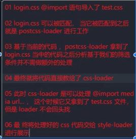

# webpack

## webpack5 从入门到放弃

[官网参考](https://www.webpackjs.com/guides/)<br/>
[源码参考](https://github.com/jiangxiaoyu66/modular-normalization/tree/main/02-02-02-01-webpack5-demo) or webpack5.zip

### webpack 功能

<ul>
<li>打包:将不同类型资源按模块处理进行打包</li>
<li>静态:打包后最终产出静态资源</li>
<li>模块:webpack支持不同规范的模块化开发</li>
</ul>

#### webpack 上手

默认打包入口:src/index.js

```bash
npm i webpack webpack-cli -D
npx webpack  # 忽略warning

├── dist              #打包后的文件夹
│   └── main.js
├── src
│   ├── js
│   │   ├── api.js
│   │   └── utils.js
│   └── index.js
├── index.html
├── package-lock.json
└── package.json
```

```html
<body>
  <script src="./dist/main.js"></script>
</body>
```

```js
// index.js
import { sum, square } from "./js/utils.js";
const person = require("./js/api.js");
console.log(sum(Math.floor(Math.random() * 10), 3));
console.log(square(4));
console.log(person);
// api.js
module.exports = {
  name: "zs",
  age: 14,
};
// util.js
const sum = (m, n) => m + n;
const square = (m) => m * m;

export { sum, square };
```

#### webpack 配置文件

如果需要更换打包入口文件(比如 src/main.js), 且输出目录名由 dist 改为 build，
则需要在 webpack 命令后面加入参数:

```bash
npx webpack --entry ./src/main.js --output-path ./build # 注意index.html的script标签路径同步更改
```

将上述目录移到 package.json 的 scripts 中:

```json
  "scripts": {
    "test": "echo \"Error: no test specified\" && exit 1",
    "build": "webpack --entry ./src/main.js --output-path ./build"
  },
```

就可以通过命令`npm run build`简洁运行<br/>
可以将上述参数移到`webpack.config.js`中，层次更加清晰(将 src/main.js 改回 src/index.js)

```js
const path = require("path");

module.exports = {
  entry: "./src/index.js",
  output: {
    filename: "build.js",
    path: path.resolve(__dirname, "dist"),
  },
};
```

package.json 的 scripts 里的 build 命令可简化为:`"build": "webpack"`

#### webpack 依赖图

1.要把需要打包的依赖导入到 src/index.js 中来; <br/> 2.自定义 webpack.config.js 名后，在 scripts 脚本中指定新配置文件名，如:<br/>
`"build": "webpack --config rr.webpack.js"`

#### CSS-loader

<ul>
<li>1.为什么需要loader</li>
<li>2.loader是什么</li>
<li>3.css-loader</li>
</ul>
添加文件

```js
// src/js/login.js
function login() {
  const oH2 = document.createElement("h2");
  oH2.innerHTML = "rr learn webpack";
  oH2.className = "title";
  return oH2;
}

document.body.appendChild(login());

// src/index.js
import "./js/login.js";
```

重新打包`npm run build`, 打开 index.html

再次添加文件 src/css/login.css:

```css
.title {
  color: red;
}
```

src/js/login.js 第一行加入 import: `import "../css/login.css";`
再次 run build 发现报错。需要一个合适的 loader<br/>

安装 css-loader:`npm i css-loader -D`<br/> 1.行内 loader(修改 src/js/login.js 第一行):
`import "css-loader!../css/login.css";` build 不报错但是样式未生效，还需要一个 loader...<br/> 2.恢复 login.js import 后, 在 webpack.config.js 添加:

```js
  module: {
    rules: [
      //   {
      //     test: /\.css$/, // 一般是一个正则表达式，用于匹配我们需要处理的文件类型
      //     use: [
      //       {
      //         loader: "css-loader",
      //         // options:
      //       },
      //     ],
      //   },

      // 简写方式1
      //   {
      //     test: /\.css$/,
      //     loader: "css-loader",
      //   },
      // 简写方式2
      {
        test: /\.css$/,
        use: ["css-loader"],
      },
    ],
  },
```

因为 css-loader 只起到让 webpack 识别 css 文件的功能，具体样式生效还需要下一个 loader

#### style-loader

`npm i style-loader -D`<br/>
webpack.config.js 修改:`use: ["style-loader", "css-loader"],`<br/>
loader 默认加载顺序: 从右往左，从下往上<br/>
重新 build，运行

#### less-loader

1.less 简单使用(要先装 less):

```less
// src/css/login.less
@bgColor: seagreen;
@fontSize: 100px;

.title {
  background-color: @bgColor;
  font-size: @fontSize;
}
```

安装 less:`npm i less -D`

```bash
npx less src/css/login.less index.css # 根目录生成index.css
```

2.less-loader 使用:
login.js 中添加 import:

```js
// ...
import "../css/login.less";
// ...
```

安装 less-loader:`npm i less-loader -D`<br/>
webpack.config.js 中添加:

```js
      {
        test: /\.less$/,
        use: ["style-loader", "css-loader", "less-loader"],
      },
```

重新`npm run build`,浏览器打开 index.html

#### sass-loader

`npm i sass sass-loader -D`

```scss
//login.scss
$border-color: orange;

.title {
  border: 10px solid $border-color;
}
```

`npx sass src/css/login.scss index.css`额外生成.map 文件<br/>

login.less 导入`import "../css/login.scss";`, 重新 build

#### browserslistrc 工作流程

a.工程化 b.兼容性:CSS JS c.如何实现兼容 d.兼容哪些平台
[参考浏览器使用情况](https://caniuse.com/usage-table)<br/>

方法 1: `npx browserslist`<br/>

```js
//package.json
"browserslist": [
  ">1%",
  "last 2 version",
  "not dead"
]
// 再次运行 npx browserslist
```

方法 2: .browserslistrc 文件，去掉之前加在 package.json 中的:

```bash
> 1%
last 3 version
not dead
```

#### postcss 工作流程

postcss 是 js 转换样式的工具<br/>
`npm i postcss postcss-cli autoprefixer -D`<br/>
[autoprefixer](https://autoprefixer.github.io/) 要 fq

```css
/*src/css/test.css*/
.title {
  display: grid;
  transition: all 0.5s;
  user-select: none;
}
```

login.js 中添加`import "../css/test.css";
`<br/>
`npx postcss --use autoprefixer -o ret.css ./src/css/test.css`

#### postcss-loader 处理兼容

将 test.css 的部分内容移动到 login.css 中, login.js 中去掉 import test.css:

```css
.title {
  color: red;
  transition: all 0.5s;
  user-select: none;
}
```

安装`npm i postcss-loader -D`

```js
      {
        test: /\.css$/,
        use: [
          "style-loader",
          "css-loader",
          {
            loader: "postcss-loader",
            options: {
              postcssOptions: {
                plugins: [require("autoprefixer")],
              },
            },
          },
        ],
      },
```

安装预设:`npm i postcss-preset-env -D`

```js
 postcssOptions: {
                // autoprefixer包含在postcss-preset-env中
                plugins: [require('postcss-preset-env')],
              },
```

注释掉 login.less 中的 background-color:`   // background-color: @bgColor;`<br/>
修改 login.css 颜色值为`  color: #12345678;`<br/>
打包`npm run build`<br/>

简写:

```js
//  postcss.config.js
module.exports = {
  plugins: [require("postcss-preset-env")],
};
```

```js
// webpack.config.js
      {
        test: /\.css$/,
        use: ["style-loader", "css-loader", "postcss-loader"],
      },
      {
        test: /\.less$/,
        use: ["style-loader", "css-loader", "postcss-loader", "less-loader"],
      },
```

#### importLoaders 属性

```css
/* 恢复test.css */
.title {
  transition: all 0.5s;
  user-select: none;
}
```

```css
/* login.css改为import test.css */
@import "./test.css";
.title {
  color: #12345678;
}
```

npm run build 打包发现页面中的.title 样式没有兼容写法

修改 webpack.config.js:

```js
use: [
          "style-loader",
          {
            loader: "css-loader",
            options: {
              importLoaders: 1, // 往上一个loader(postcss-loader)
            },
          },
          "postcss-loader",
        ],
```

#### file-loader 处理图片

打包图片:<br/>
img src: 使用 require 导入图片，如不配置 esModule: false, 则需.default 导出；也可以在配置中设置 esModule: false; 或者采取 import xxx from '图片路径', 此时就可直接使用<br/>
background url: 在 css-loader 中要加 esModule: false

`npm i file-loader -D`
1.img src

```js
// Method1
// a.add import in index.js(only this row)
import "./js/image.js";
// b.src/js/image.js
function packImg() {
  const ele = document.createElement("div");
  const imgEle = document.createElement("img");
  imgEle.src = require("../image/1.jpg"); // .default
  ele.appendChild(imgEle);
  return ele;
}

document.body.appendChild(packImg());
// c.webpack.config.js
 {
    test: /\.(png|svg|jpe?g|gif)$/,
    use: [
      {
        loader: "file-loader",
        options: {
          esModule: false, // 不转为esModule，不需要.default了
        },
      },
    ],
  },

// Method2
import oImage1Src from "../image/1.jpg";

function packImg() {
  const ele = document.createElement("div");
  const imgEle = document.createElement("img");
  imgEle.src = oImage1Src;
  imgEle.width = 600;
  ele.appendChild(imgEle);
  return ele;
}

document.body.appendChild(packImg());
// --------------------------------------------
       {
        test: /\.(png|svg|jpe?g|gif)$/,
        use: [ "file-loader"],
      },
```

2.background-url

```js
// image.js设置背景图片
import "../css/image.css";
// ...
const oBgImg = document.createElement("div");
oBgImg.className = "bg-box";
ele.appendChild(oBgImg);
// ...

// src/css/image.css
.bg-box {
  width: 200px;
  height: 200px;
  background-image: url("../image/dt.png");
}

// webpack.config.js css-loader options配置多加esModule: false
 {
        test: /\.css$/,
        use: [
          "style-loader",
          {
            loader: "css-loader",
            options: {
              importLoaders: 1,
              esModule: false, // !important
            },
          },
          "postcss-loader",
        ],
  },
```

#### 设置图片名称与输出

```js
/**
[ext]: 拓展名
[name]: 文件名
[hash]: 文件内容
[contentHash]:
[hash:<length>]
[path]:
 */
use: [
      {
        loader: "file-loader",
        options: {
          name: "img/[name].[hash:6].[ext]",
          //outputPath: "img",
        },
      },
    ],
```

#### url-loader 处理图片

`npm i url-loader -D`
将 webpack.config.js 中的 file-loader 替换成 url-loader 即可<br/>
url-loader 不会拷贝图片到打包后的目录下，而是以 base64 方式引入图片，能减少请求次数。如果想拷贝图片文件，就加 limit 配置

```js
 {
      test: /\.(png|svg|jpe?g|gif)$/,
      use: [
        {
          loader: "url-loader",
          options: {
            name: "img/[name].[hash:6].[ext]",
            limit: 38 * 1024, // 超过38kb就拷贝文件
          },
        },
      ],
    },
```

#### asset 处理图片(webpack5 内置)

asset module type

<ul>
<li>asset/resource -> file-loader</li>
<li>asset/inline -> url-loader</li>
<li>asset/source -> raw-loader</li>
<li>asset (parser)</li>
</ul>

```js
//webpack.config.js remove file-loader & url-loader
// 1.asset/resource
{
  test: /\.(png|svg|jpe?g|gif)$/,
  type: "asset/resource",
},
// 如果要指定路径有两种方式
// a. output中添加设置 不推荐
  output: {
   // assetModuleFilename: "img/[name].[hash:4][ext]",
  },
// b.
  type: "asset/resource",
  generator: {
    filename: "img/[name].[hash:4][ext]",
  },

// 2.asset/inline  base64
{
  test: /\.(png|svg|jpe?g|gif)$/,
  type: "asset/inline",
},

// 3.asset 配置文件限制，大文件移动，小文件base64
{
  test: /\.(png|svg|jpe?g|gif)$/,
  type: "asset",
   generator: {
    filename: "img/[name].[hash:4][ext]",
  },
  parser: {
    dataUrlCondition: {
      maxSize: 38 * 1024
    }
  }
},
```

#### asset 处理图标字体

[导入 font 目录](https://github.com/jiangxiaoyu66/modular-normalization/tree/main/02-02-02-01-webpack5-demo/15_webpack_pack_font/src/font)<br/>

```css
/** src/css/index.css */
.rr-icon {
  font-size: 50px;
  color: lightgreen;
}
```

```js
// src/js/font.js
import "../font/iconfont.css";
import "../css/index.css";

function packFont() {
  const oEle = document.createElement("div");

  const oSpan = document.createElement("span");
  oSpan.className = "iconfont icon-linggan rr-icon";

  oEle.appendChild(oSpan);

  return oEle;
}

document.body.appendChild(packFont());

// src/index.js
import "./js/font.js";
```

#### webpack 插件使用

loader 对比 plugin

<ul>
<li>loader: 转换 特定类型->模块</li>
<li>plugin: 更多事情，打包生命周期(例如压缩css)</li>
</ul>
例子:每次打包前清空之前的打包目录<br/>

`npm i clean-webpack-plugin -D`

```js
// webpack.config.js
const { CleanWebpackPlugin } = require("clean-webpack-plugin");
  // ...
  plugins: [new CleanWebpackPlugin()], // plugin本质是一个class
  // ...
```

#### html-webpack-plugin 使用

webpack 5.22.0(写这个的时候是 5.90.3 故手动安装之) 之前自带插件；该插件可自动在打包目录生成 index.html, 故先删掉 src/index.html<br/>
`npm i html-webpack-plugin -D`
创建 public/index.html

```html
<!DOCTYPE html>
<html>
  <head>
    <meta charset="utf-8" />
    <title><%= htmlWebpackPlugin.options.title %></title>
    <meta name="viewport" content="width=device-width,initial-scale=1" />
  </head>

  <body>
    <div id="app">html-webpack-plugin mock <%= BASE_URL %></div>
  </body>
</html>
```

```js
// webpack.config.js
const HtmlWebpackPlugin = require("html-webpack-plugin");
const { DefinePlugin } = require("webpack");

  plugins: [
    new CleanWebpackPlugin(),
    new HtmlWebpackPlugin({
      title: "html-webpack-plugin",
      template: "./public/index.html",
    }),
    new DefinePlugin({
      BASE_URL: '"./"', // 定义html模板中的常量
    }),
  ],
```

#### Babel 使用

JSX TS ES6 -> 浏览器平台直接使用<br/>
转换，类似 postcss，处理 JS 兼容

```js
// 先把mode用起来，webpack.config.js
module.exports = {
  mode: "development",
  // ...
};

// index.js
const str = "前端";

const printStr = () => console.log(str);

printStr();
```

打包后发现打包文件中没有对 es6 语法做处理，只是 eval

`npm i @babel/core  @babel/cli -D` <br/>
`npx babel src --out-dir build`<br/> 发现文件原封不动，原因在于缺失相应语法工具包，继续安装:<br/>
`npm i @babel/plugin-transform-arrow-functions -D`<br/>
`npx babel src --out-dir build --plugins=@babel/plugin-transform-arrow-functions`<br/>
发现箭头函数转换成功了，接着转换 const:<br/>
`npm i @babel/plugin-transform-block-scoping -D`<br/>
`npx babel src --out-dir build --plugins=@babel/plugin-transform-arrow-functions,@babel/plugin-transform-block-scoping`<br/>
好吧，const 也转换成 var 了<br/>

这个一个一个配置太麻烦，故使用 babel 预设来简化:
`npm i @babel/preset-env -D`<br/>
`npx babel src -d build --presets=@babel/preset-env`<br/>
把.browserslistrc 兼容性改高一些, 或者删掉.browserslistrc 文件[知乎参考](https://zhuanlan.zhihu.com/p/414255779?utm_id=0):
`0.01%`

#### babel-loader

`npm i babel-loader -D`

配置方式 1

```js
// webpack.config.js
  {
    test: /\.js$/,
    use: [
      {
        loader: "babel-loader",
        options: {
          presets: [
            [
              "@babel/preset-env",
              // {
              //   targets: "chrome 91", // 将不会转成es5，因为91版本对es6已有支持，推荐写进.browserslistrc
              // },
            ],
          ],
          // plugins: [
          //   "@babel/plugin-transform-arrow-functions",
          //   "@babel/plugin-transform-block-scoping",
          // ],
        },
      },
    ],
  },
```

配置方式 2 babel.config.js(json cjs mjs) v7 之前:babelrc.json(js) .babelrc

```js
// webpack.config.js
      {
        test: /\.js$/,
        use: ["babel-loader"],
      },

// babel.config.js
module.exports = {
  presets: [
    [
      "@babel/preset-env",
      {
        targets: "chrome 91",
    ],
  ],
};
```

#### polyfill 配置

背景: preset 并不支持所有的兼容语法，如 promise，所以用到 polyfill (webpack v5 之前内置)来补充
`npm i @babel/polyfill` [core-js regenerator-runtime](https://babeljs.io/docs/babel-polyfill)
故不需要@babel/polyfill，卸载之, 然后重新安装:<br/>
`npm i core-js@2` 装新版本 core-js3 容易漏包 <br/>

```js
// index.js
const p = new Promise((resolve, reject) => {
  resolve(1);
});
console.log(p);

// webpack.config.js
// devtool: false,
  {
    test: /\.js$/,
    exclude: /node_modules/,
    use: ["babel-loader"],
  },

  // babel.config.js
  module.exports = {
    presets: [
      [
        "@babel/preset-env",
        {
          useBuiltIns:
            "usage" /* default: false 不对当前的JS处理器做polyfill填充; 'usage': 依据用户源代码当中使用到的新语法进行填充; 'entry': 依据兼容浏览器.broserslistrc文件决定填充什么，记得index.js要导入corejs&runtime */,
          corejs: 2,
        },
      ],
    ],
  };
```

#### copy-webpack-plugin

目的: cp public/favicon.ico into dist folder<br/>
`npm i copy-webpack-plugin -D` <br/>

```html
<!-- index.html -->
<link rel="icon" href="<%= BASE_URL %>favicon.ico" />
```

```js
// webpack.config.js
const CopyWebpackPlugin = require("copy-webpack-plugin");

  output: {
    filename: "js/build.js",
  }

    new CopyWebpackPlugin({
      patterns: [
        {
          from: "public",
          globOptions: {
            ignore: ["**/index.html"], // **表示public
          },
        },
      ],
    }),

// index.js
import "./js/font.js";
import "./js/image.js";

```

#### webpack-dev-server 初始

解决修改源码后需要重新 run build 才能使页面生效的问题<br/>
方法 1: a. package.json scripts build 脚本加 --watch<br/> `webpack --config webpack.config.js --watch`<br/>
b. webpack.config.js 加 watch 选项为 true:<br/>

```js
module.exports = {
  watch: true, // 默认false，性能问题
  // ...
};

// 不足
/**
 1. 所有源代码都会重新编译
 2. 每次编译成功之后都需要进行文件读写
 3. live server会把整个页面都刷新，不能实现局部更新
 */
```

方法 2: webpack-dev-server<br/>
`npm i -D webpack-dev-server`

```bash
# package.json 配置 serve scripts(--config webpack.config.js如果没改配置名可不加)
    "serve": " webpack serve --config webpack.config.js"
```

直接`npm run serve` 通过命令行提示浏览器[打开](http://localhost:8080/)<br/>
不会产生打包目录，把数据写进内存里面，所以很快!

#### webpack-dev-middleware 使用

`npm i express webpack-dev-middleware`

```js
// src/server.js
const express = require("express");
const webpackDevMiddleware = require("webpack-dev-middleware");
const webpack = require("webpack");

const app = express();

// 获取配置文件
const config = require("./webpack.config");
const compiler = webpack(config);

app.use(webpackDevMiddleware(compiler));

// 开启端口上的服务
app.listen(3000, () => {
  console.log("server is running on port 3000");
});
```

` node .\server.js`

#### HMR(Hot Module Replacement)使用

对局部的模块进行替换, 不会全局刷新

```html
<!-- public/index.html -->
<div id="app">
  <input type="text" />
</div>
```

```js
// webpack.config.js
module.exports = {
  // ...
  target: "web", // 屏蔽browserslist
  devServer: {
    hot: true, // 开启热更新
  },
  // ...
};

// src/js/title.js
module.exports = "This is title.js module, and I will change it";

// index.js
import "./js/title";

// 希望哪些模块热更新(局部刷新，不会清空修改代码前input框输入内容)
if (module.hot) {
  module.hot.accept("./js/title", () => {
    console.log("title.js 模块热更新");
  });
}
```

#### React 组件支持热更新

```bash
npm i -D @babel/preset-react
npm i react react-dom
```

```js
// src/App.jsx
import { useState } from "react";

export default function App() {
  const [title, setTitle] = useState("React前端");
  return (
    <>
      <h2>{title}</h2>
    </>
  );
}

// src/index.js
import ReactDOM from "react-dom/client";
import App from "./App.jsx";

import "./js/title";

if (module.hot) {
  module.hot.accept("./js/title", () => {
    console.log("title.js 模块热更新");
  });
}

ReactDOM.createRoot(document.querySelector("#app")).render(<App />);

// babel.config.js
module.exports = {
  presets: [
    ["@babel/preset-env"],
    [
      "@babel/preset-react",
      {
        runtime: "automatic", // 要加上这行配置
      },
    ],
  ],
};
// webpack.config.js
   // remove
      // {
      //   test: /\.js$/,
      //   exclude: /node_modules/,
      //   use: ["babel-loader"],
      // },
      {
        test: /\.jsx?$/,
        use: ["babel-loader"],
      },
```

` npm i -D @pmmmwh/react-refresh-webpack-plugin react-refresh` 用比较新版本的 node&npm 不行就 yarn 试试

#### Vue 组件支持热更新

```bash
yarn add vue@2.6.14
yarn add vue-template-compiler@2.6.14 -D
"vue-loader": "^15.9.8" IN DEV & yarn install # yarn add 一直报错&高版本for vue3
```

```js
// src/App.vue
<template>
    <div class="example">{{ msg }}</div>
</template>

<script>
export default {
    data: {
        msg: 'Hello, Vue world!'
    }
}
</script>

<style>
.example {
    color: red
}
</style>

/* src/index.js */
import Vue from "vue";
import App from "./App.vue";

import "./js/title";

if (module.hot) {
  module.hot.accept("./js/title", () => {
    console.log("title.js 模块热更新");
  });
}

new Vue({
  render: (h) => h(App),
}).$mount("#app");


/*webpack.config.js*/

const VueLoaderPlugin = require("vue-loader/lib/plugin");
      {
        test: /\.vue$/,
        use: ["vue-loader"],
      },
new VueLoaderPlugin(),

```

## webpack 实战

是一款模块打包工具

```bash
mkdir hello-webpack
cd hello-webpack
npm init -y
npm i webpack webpack-cli -D
npx webpack -v # 5.x
```

```html
<!--index.html-->
<body>
  <script src="./dist/bundle.js"></script>
</body>
```

```js
// add-content.js
export default function () {
  document.write("Hello, world!");
}
```

```js
// index.js
import addContent from "./add-content";
document.write("My First Webpack app.<br/>");

addContent();
```

打包

```bash
npx webpack --entry=./index.js --output-filename=bundle.js --mode=development
```

浏览器打开 index.html<br/>
将命令配到 package.json 的 scripts 中

```json
//...
  "scripts": {
    "build": "webpack --entry=./index.js --output-filename=bundle.js --mode=development"
  },
//...
```

重新打包<br/>
`npm run build` <br/>

webpack 默认源代码入口是`src/index.js`, 将 index.js&add-content.js 移动到 src 下后，命令要简化为:

```bash
  "scripts": {
    "build": "webpack --output-filename=bundle.js --mode=development"
  },
```

webpack 配置参数`npx webpack -h`<br/>
webpack 配置项太多，有简单的办法就是将配置配到`webpack.config.js`文件中:

```js
module.exports = {
  entry: "./src/index.js",
  output: {
    filename: "bundle.js", // output.path要求使用绝对路径，webpack帮做了join(path+dist)
  },
  mode: "development",
};
```

package.json 的 build script 进一步简化:
命令要简化为:

```bash
  "scripts": {
    "build": "webpack"
  },
```

### webpack-dev-server @Deprecated

```bash
npm i webpack-dev-server -D
```

在 package.json 中添加:

```bash
  "scripts": {
    "build": "webpack",
    "dev": "webpack-dev-server"
  },
```

在 webpack.config.js 中添加:

```js
module.exports = {
  // ...
  mode: "development",
  devServer: {
    host: "localhost", // 启动服务器域名
    port: "8888", // 启动服务器端口号
    open: true, // 是否自动打开浏览器
  },
};

// previous version
module.exports = {
  // ...
  mode: "development",
  devServer: {
    publicPath: "./dist",
  },
};
```

```

```
