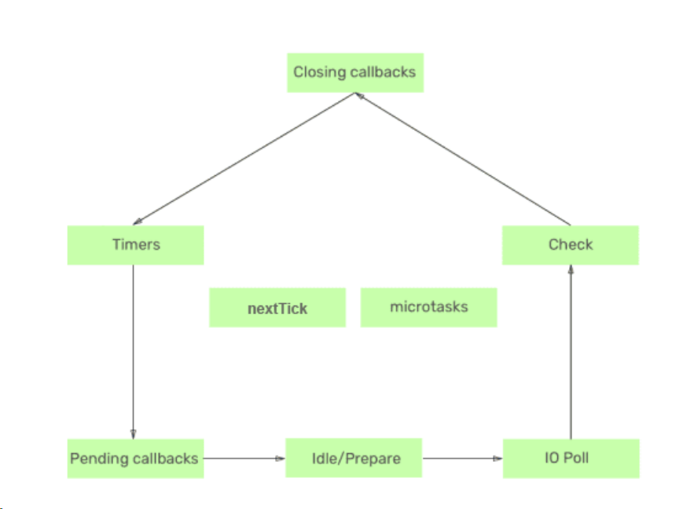

# NodeJS

### 安装&环境变量

## 全局对象

#### global(和 browser 端的 window 对象区分)

`var message = "hello"
console.log(global.message) // undefined
`

#### 只导出一个变量

`module.exports = function() { xxx }`

#### 模块包装函数

`(module wrapper function)
(function(exports, require, module, __filename, __dirname){
	// entire module code lives here
});
`

##### module.exports 和 exports 区别

### 内置模块

**_path, File system_**

`fs.readdir("./", function (error, files) {
    // 错误优先回调函数，第一个函数永远是error
  console.log(error); // null
  console.log(files);
});`

## npm

> package.json 记录软件包的名字+版本
> package-lock.json 记录软件包及软件包的依赖包的下载地址及版本

xxx@^m.a.b 主要版本，次要版本，补丁版本
^xx.yy.zz
~xx.yy.zz

npm list --depth 0
npm view lodash

npm outdated/ npm update

### 项目依赖/开发依赖

生产环境: npm install --prod // 跳过安装 DevDependences 里的依赖

### 全局安装和本地安装

npm root -g // 查看路径
npm-check-updates // ncu -u

## npmjs.org 上发布 package

1.sign up 2.npm login 3.npm publish
更新版本号
npm version major/minor/patch
撤销软件包(24 小时)
npm unpublish <pkg> --force

更改 npm 镜像地址  
npm config list
npm config set registry https://registry.npm.taobao.org  
npm config set registry https://registry.npmjs.org

> npm config get userconfig | cat .npmrc

### npx 两个作用

1.临时安装软件包执行后删除 npx create-react-app helloworld 2.执行本地安装的软件包 在应用中可以通过 npx 调用 node_modules 文件夹中安装的命令工具

### node 项目默认入口文件 package.json "main": "index.js",

node index.js or node foldername

### 模块查找规则

1.带路径
const server = require('./server');
a.同级目录的 server.js
b.同级目录的 server.json
c.server 目录的 package.json main(默认 index.js)

2.不带路径
const server = require('server');
按 nodule.paths 顺序

### I/O 模型

同/异步 I/O 区别: CPU 是否等待 I/O 结果
Node 采用异步非阻塞 I/O 模型

## 进程与线程

### JS 单线程 OR 多线程

libuv
一个主线程+线程池中 4 个线程，前者执行同步代码，后者执行异步代码  
`const crypto = require("crypto");   
 for (let i = 0; i < 2; i++) {
  crypto.pbkdf2Sync("srcret", "salt", 10000, 512, "sha512"); // sync
  // crypto.pbkdf2('srcret', 'salt', 10000, 512, 'sha512') // async
}
`

## 回调

callback -> call then back, 调用后返回
在主函数 b 中调用参数函数 a，参数函数调用完成后返回主函数继续执行主函数中的代码  
`function a() {
    console.log('a is running')
}
function b(callback) {
    console.log('b start');
    callback(); // a is running
    console.log('b end');
}
b(a);`

> 为什么在 B 函数中不直接调用 A 函数而要通过参数的方式传递进去?
> 通常在编写应用程序时，B 函数都是语言内部或者其他开发者定义好的，我们看不到内部代码或者说不能直接在他内部代码中插入我们的代码，而我们又想介入程序的执行，此时就可以通过回调函
> 数的方式将我们的逻辑传递给 B 函数，B 函数在内部再来调用这个回调函数。

```
function readFile(filePath, defaultCoding = "utf-8") {
  return new Promise(function (resolve, reject) {
    fs.readFile(filePath, defaultCoding, function (error, data) {
      if (error) {
        reject(error);
      } else {
        resolve(data);
      }
    });
  });
}
// solution 1
readFile("./a.txt")
  .then(function (data) {
    console.log(data);
    return readFile("./b.txt");
  })
  .then(function (data) {
    console.log(data);
    return readFile("./c.txt");
  })
  .then(function (data) {
    console.log(data);
  })
  .catch(function (error) {
    console.error(error);
  });

  // solution 2
  Promise.allSettled([
  readFile("./a.txt"),
  readFile("./b.txt"),
  readFile("./c.txt"),
])
  .then(function (data) {
    console.log(data);
  })
  .catch(function (error) {
    console.error(error);
  });

readAPromise.then(function(result) {
    console.log(result);
}).catch(function(error) {
    console.error(error);
});
// solution 3
const fs = require("fs");

function readFile(filePath, defaultCoding = "utf-8") {
  return new Promise(function (resolve, reject) {
    fs.readFile(filePath, defaultCoding, function (error, data) {
      if (error) {
        reject(error);
      } else {
        resolve(data);
      }
    });
  });
}

(async function() {
  const aFile = await readFile('./a.txt');
  const bFile = await readFile('./b.txt');
  const cFile = await readFile('./c.txt');
  console.log(aFile, bFile, cFile);
})();
```

### 异步函数

```
async function f() {
  return "a";
}

// console.log(f()); // Promise { 'a' }
f()
  .then(function (data) {
    console.log(data); // a
  })
  .catch(function (error) {
    console.error(error);
  });
```

#### 使用 promisify 方法

去掉 readFile Promise 函数中的回调

```
const fs = require("fs");
const promisify = require('util').promisify;
const readFile = promisify(fs.readFile);

async function readAllFile() {
  const aFile = await readFile("./a.txt", "utf-8");
  const bFile = await readFile("./b.txt", "utf-8");
  const cFile = await readFile("./c.txt", "utf-8");
  return [aFile, bFile, cFile];
}

readAllFile().then(([a, b, c]) => console.log(a, b, c));
```

## 事件循环

> 1.NodeJS 是事件驱动的，可以将异步 API 的回调函数理解为事件处理函数。同步代码在主线程执行，异步代码在 C++维护的那个线程池中执行，管理异步代码中的回调函数什么时候回到主线程中调用的机制就叫事件循环。

#### 6 个阶段


Timers->Pending callbacks-> Idle/Prepare -> IO Poll -> Check -> Closing callbacks

### 宏任务和微任务

宏: setTimeout, setInterval, setImmediate, I/O
微: Promise.then, Promise.catch, Promise.finnay, process.nextTick

区别: 1.宏的回调函数放宏任务队列，微放微队列 2.优先级 nextTick > 微 > 宏

Node 应用启动后，并不会立即进入事件循环，而是先从上到下执行，同步 API 先执行，异步 API 交给 C++维护的线程执行，异步 API 的回调函数被注册到对于的事件队列中，当所有输入代码执行完成后，开始进入事件循环

`console.log('start');
setTimeout(() => {
  console.log('1')
}, 0);
setTimeout(() => {
  console.log('1')
}, 0);
console.log('end'); // start end 1 2`

### process.nextThick 方法

> 此方法的回调函数优先级最高，会在事件循环之前调用；如果希望异步任务尽早执行，就可以使用 process.nextThick
> `
> const fs = require('fs');
> function readFile(fileName, callback) {
> if (typeof fileName !== "string") {

    // If here, it's not async completely
    // return callback(new TypeError('file name must be string type'));
    // After change
    return process.nextTick(
      callback,
      new TypeError("file name must be string type")
    );

}
fs.readFile(fileName, (err, data) => {
if (err) {
return callback(err);
}
return callback(null, data);
});
}
`

### setImmediate

> 宏任务，表立即执行，事件循环的 check 阶段(不会阻塞主线程，也不会阻塞事件循环)，适合处理大量的计算任务

`// Block main thread
function sleep(delay) {
    // Mock 
    const pre = Date.now();
    while(Date.now() - pre < delay) {
        continue;
    }
}
// Condition 1
// console.time('c1')
// console.log('start 1');
// sleep(3000);
// console.log('end 1');
// console.timeEnd('c1');
// Condition 2
console.time('c2');
console.log('start 2');
setImmediate(sleep, 3000); // block c++ thread
console.log('end 2');
console.timeEnd('c2');
`
